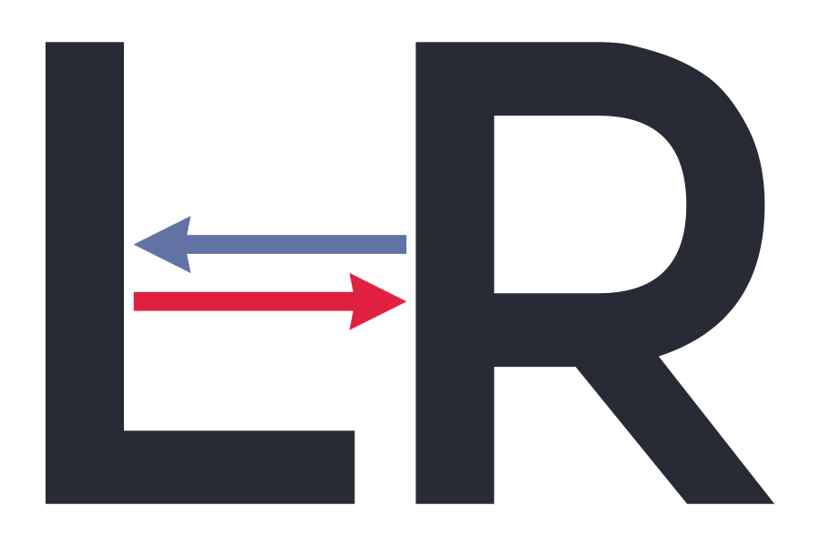
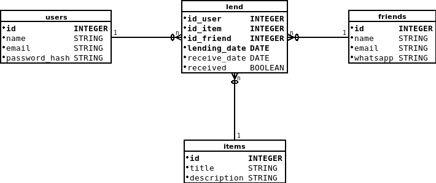

<br/>

<h1 align="center">
  
</h1>

<h2 align="center">API</h2>

<p align="center">Remember of things and for who you lend with Lend-Remember!!</p>

<p align="center">
  

  

  <a href="https://github.com/alefemoreira/lend-remember-api/commits/master">
    
  </a>

  <a href="https://github.com/alefemoreira/lend-remember-api/issues">
    
  </a>

  
</p>

<p align="center">
  <a href="#rocket-technologies">Technologies</a>&nbsp;&nbsp;&nbsp;|&nbsp;&nbsp;&nbsp;
  <a href="#computer-project">Project</a>&nbsp;&nbsp;&nbsp;|&nbsp;&nbsp;&nbsp;
  <a href="#memo-license">License</a>
</p>

<br/>

---

## :rocket: Technologies

This project was developed with the following technologies:

- [Node.js](https://nodejs.org/en/)

<br/>

## :computer: Project

System for you do not forget who you lent each thing.

### :scroll: Stories

[Link of stories' project](https://github.com/alefemoreira/lend-remember-api/wiki/Stories-of-Project)

### :clipboard: Database Schema

<p align="center">
  
</p>

<br/>

## :clipboard: Commands

### Production
```
yarn start
```

### Development
```
yarn dev
```

### Test
```
yarn test -i
```


<br/>

## :memo: License

Esse projeto está sob a licença MIT. Veja o arquivo [LICENSE](LICENSE) para mais detalhes.

<br/>

---

Based on project [Projetos (reais) para aprender programação](https://www.tiagogouvea.com.br/profissional/projetos-reais-aprender-programacao/), written by [Tiago Gouvêa](https://github.com/TiagoGouvea)
